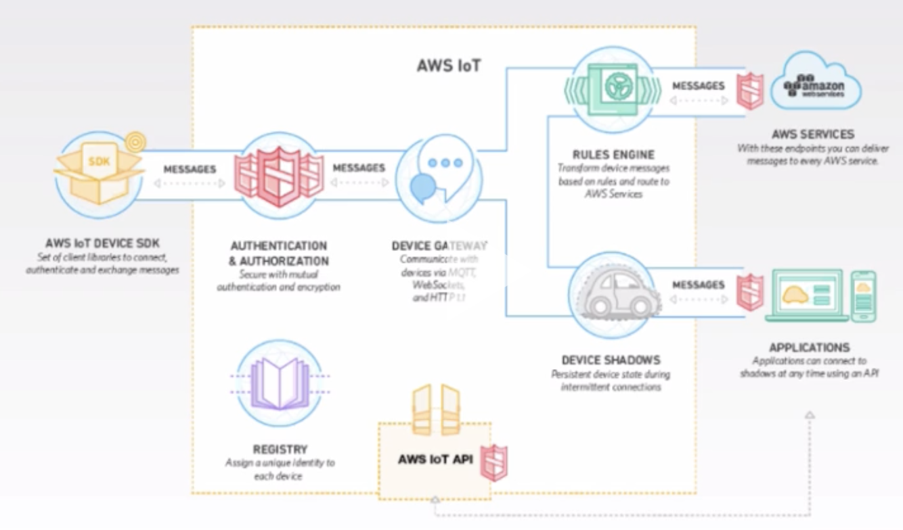

### IoT

* [Core Tenets of IoT Whitepaper](https://d0.awsstatic.com/whitepapers/core-tenets-of-iot1.pdf)

* IoT service - allows devices to interact securely with applications and other devices

* Billions of devices, trillions of messages

* Can process & route messages to AWS services & other devices

* Once data hits AWS IoT, a rule action is triggered triggered to send data to one of the following:

    * Elasticsearch

    * Kinesis Firehose

    * Kinesis Streams

    * DynamoDB

    * AWS Machine Learning

* IoT rule actions also allow you to:

    * Change / capture CloudWatch alarm / metric

    * Write data to S3

    * Write data to SQS

    * Write data to SNS as a push notification

    * Invoke Lambda function

[https://aws.amazon.com/iot-platform/how-it-works/](https://aws.amazon.com/iot-platform/how-it-works/)

NOTE: See [Core Tenets of IoT Whitepaper notes](../Additional_Reading/1_Core_Tenets_of_IoT.md) for summary of the whitepaper, includes information from lecture

#### Security

**Authentication**

* Each connected device requires an X.509 certificate

* Each certificate must be provisioned, activated, and installed on a device before it can be used as a valid identity w/ AWS IoT

* Can generate certs, private key and public key with AWS IoT Certificate Authority

* Can upload your own Certificate Signing Request (CSR) based on a private key you own

* Can register your own CA certificate, and use your own certificates

* Uses IAM policies for Users, Groups and Roles, so of course, if you need IoT to write to DynamoDB, for example, you need a policy that will allow you to do that

**Cognito Identity**

* Can use Amazon Cognito for mobile applications to authenticate

* Cognito identity can give fine-grained permissions to individual mobile app user of your IoT application

* Allows you to use your own identity provider

* Can use login with Amazon, Facebook, Google, Twitter

* Can use OpenID providers, and SAML identity providers

* Can use Cognito Identity User Pools (scale to millions of users)

**How Cognito Works With IoT**

* AWS IoT allows a policy to be attached to Cognito Identities

    * With this policy, user gets permissions connecting to IoT app

    * When you login to identity provider, you get an access token back from the identity provider

    * Access token is then exchanged with Cognito in return for temporary credentials

    * Temporary credentials then grant access to AWS IoT

* Cognito identities can be used to authenticate against AWS IoT - specifically for mobile users

* Cognito Identity User Pools can be used instead, and can scale to millions of users

**Authorization**

* AWS IoT - two types of policies are used to control operations an identity can perform

    * AWS IoT Policies

    * IAM Policies

    * AWS IoT Operations - split into:

        * **Control plane API** - administrative tasks (e.g., creating certificates, creating rules)

        * **Data plane API** - sending and receiving data from AWS IoT

    * The policy you use will depend on types of operations you intend to perform - [review the two tables on this page](http://docs.aws.amazon.com/iot/latest/developerguide/authorization.html) (**probably no exam questions** on these tables though)

**Device Gateway (aka Message Broker)**

* Maintains sessions and subscriptions for all connected devices

* Allows secure 1:1 and 1:many communications

* "Topic" is what device gateway uses to route messages from publishing clients to subscribing clients

* Scales automatically to support over 1 billion devices

* Protocols:

    * MQTT (Message Queue Telemetry Transport) - lightweight, used on top of TCP/IP - ideal for IoT, designed for connections w/ remote locations where network bandwidth is limited 
    * WebSockets

    * HTTP

**Device Registry**

* Central repository for storing attributes related to each "thing"

* **"Thing"** - represents physical device (e.g., sensor) or logical entity (e.g., app)

* Can get ARN of any "thing" here

**Device Shadow (aka "Thing Shadow")**

* JSON document used to store and retrieve the current state for a thing

* Device Shadow is maintained for each thing connected to AWS IoT

* Acts as a message channel to send commands to a thing

* Stores last known state in AWS IoT service

**Rules Engine**

* Provide a thing the ability to interact with the AWS IoT service and other services

* Rules enable you to transform messages and route them to various AWS services

* Messages are transformed using a SQL-based syntax (think of SQL syntax as the rule)

* Based on the rule, a rule action is triggered and that rule action kicks off the delivery of the message to other AWS services

**For the exam, remember:**

* You can create rule actions for:

    * Lambda

    * Kinesis Firehose

    * Kinesis Streams

    * DynamoDB

    * AWS Machine Learning

* Some questions are on rules / rule actions, others combined w/ services like Kinesis and DynamoDB

* Have a general understanding of topics in this lecture

    * Basics of authorization and authentication

    * Pay **special** attention to how Cognito works w/ AWS IoT

    * Understand device gateway, device registry, device shadow

    * Know what rules engine does

    * Know what a rule action does

* Cognito identities can be used to authenticate against AWS IoT - specifically for mobile users

* Cognito Identity User Pools can be used instead, and can scale to millions of users
