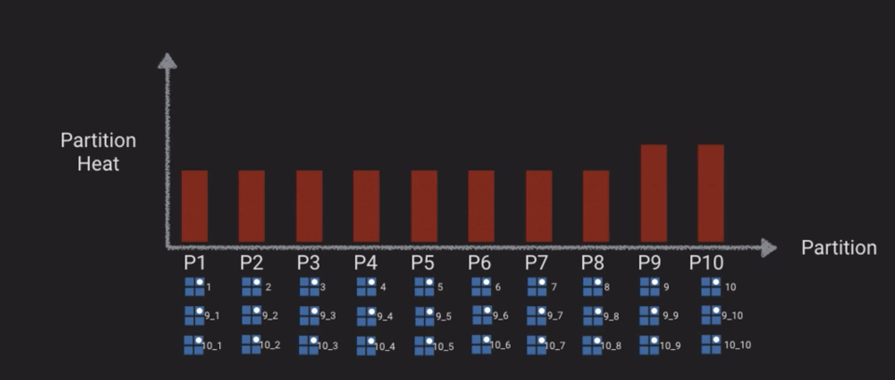

### DynamoDB Performance Deep Dive Part 1 of 2

* Partitions - key performance building block

* **Partitions** - Units of storage & performance that underpin the reads and writes b/t DynamoDB and underlying storage infrastructure

* Two formulas to know to determine number of partitions created - one based on performance, one based on capacity

#### Performance

* Partitions
<pre>
(desired RCU / 3000 RCU) + (desired WCU / 1000 WCU)
</pre>
Then round up.  That means DynamoDB will provide you with one partition per 3000 RCUs or 1000 WCUs of performance reservation

* E.g., if you want to achieve 7500 Reads / sec and 3000 writes / sec:

<pre>(7500 / 3000 RCU) + (3000 / 1000 WCU) = 2.5 + 3 = 5.5</pre>

* Round up to **6**

#### Capacity / Size**

* Partitions 

<pre>Data GB in size / 10 GB</pre>

* E.g., for 65 GB:

<pre>65 GB/10 GB = 6.5</pre>

* Round up to **7**

* The actual number of partitions you need is the maximum of these two:

`MAX(6,7) = 7`

* so you need 7 partitions to meet performance and capacity expectations

* So now we know the number of partitions, but how does that really influence performance?

* Our allocated reads and writes are distributed across partitions - e.g., with 4,000 WCUs and 4 partitions, each partition will get 1,000 WCUs

* So we only get 4,000 WCUs if we’re reading data in parallel (evenly) across all partitions, and we only get this if we have a good partition-key model

* What makes a good key?  Anything below 3,000 read or 1,000 write is achievable, even with a poorly selected key

* When you NEED a good key, these are the criteria:

    * Attribute should have many distinct values

    * The attribute should have a uniform write pattern across all partition key values (e.g., no one having a significant number more than the others)

    * Attribute should have a uniform temporal write pattern across time - writes and reads should ideally occur across different keys in a uniform way across all time periods

    * If any of the above aren’t possible with an existing value, you should consider a synthetic / created / hybrid value

    * You shouldn’t mix HOT and COLD key values within a table

* AWS use case - political parties - you may have 2-3 popular candidates who may get most of the votes, create a Votes table,  10 candidates, 10,000 WCU

    * Candidate ID is partition key

    * date/time is sort key

    * Maybe an attribute identifying user info, and actual vote

    * With 10 candidates, we’ll have 10 partitions, so each one will get 1,000 WCU

    * but if only 2-3 are getting most of the votes, the unpopular candidates’ partitions won’t be using their write capacity, and the popular ones can’t make use of their capacity, they’re limited to 1,000 WCUs each

    * Further, consider that different states vote at different times, and if a candidate is popular in one time zone they’ll get more votes during peak voting times for that time zone, but not others

    * So if you have 2 popular candidates (9 and 10) and 8 less popular candidates (1-8), you can change the key strategy so you’re tacking the partition number onto the candidate key, and use that instead of the candidate key
    
    * E.g., for candidate 1, tack random number between 1 and 100 to the key.  The key would range between 1_1 and 1_100 for 100 partitions - should then be evenly distributed among those 100 partitions

