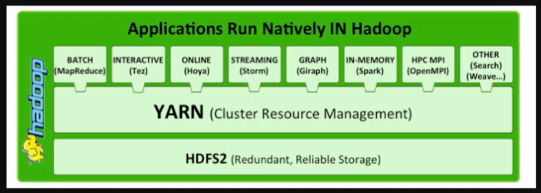

### Apache Hadoop Part 2 (not on exam?)

* Typically single master, master manages jobs on slave nodes

* Slave nodes perform jobs and coordinate w/ master and w/ each other

* YARN components

    * **Resource Manager** - scheduler, lives on master, allocates available resources on cluster against competing applications

    * **Node Manager** - lives on each slave - takes direction from resource manager, manages resources on slave

    * **Application Master** - lives on each slave - negotiates resources from Resource Manager and working w/ node manager to execute & monitor containers

    * **Container** - actual data processing takes place here - grants rights to application to use specific amounts of memory and CPU on a specific slave node

* YARN allows multiple access engines to use Hadoop as a common standard to simultaneously access the same data set

* MapReduce job tasks

    * **Input** - 

    * **Split** - 

    * **Map** - Resource Manager assigns map phase resources to do parallel processing, intermediate key/value pairs are generated

    * **Shuffle** - moves intermediate key-value pairs to the reducers - pairs sorted by key to a larger data list, data list groups equivalent keys together so their values can be iterated easily in the reduce phase

    * **Reduce** - takes grouped key/value pair data as input and runs a reducer function on all of them

    * **Result** - writes output to file

---

* [Back: Apache Hadoop Part 1 (4:39)](EMR_Apache_Hadoop_Part_1.md)
* [Next: EMR Architecture Part 1 (7:20)](EMR_Architecture_Part_1.md)
