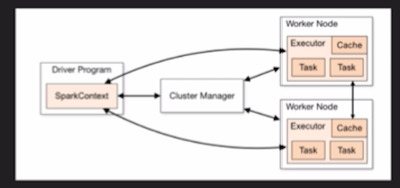

### Spark on EMR Part 1

* Spark - fast engine for processing large amounts on data

* Run in-memory = 100x faster than MapReduce

* Run on disk = 10x faster than MapReduce

* **Quite a few Spark questions on the exam!!**

#### Use cases

* Interactive analytics

* Faster than running queries in Hive

* Flexibility in terms of languages (Scala, Java, Python, etc.)

* Spark 2.0 - **Structured Streaming** - ability to query live data

* **Stream processing** w/ Spark Streaming

    * Disparate data sources

    * Data in small sizes

* **Machine learning (MLlib)**

    * Repeated queries against datasets

    * Train machine learning algorithms

    * Recommendation engines

    * Fraud detection

    * Customer segmentation

    * Security

* **Data Integration** (e.g., ETL) - reduces time and cost

#### When NOT to use Spark

* Not a database for OLTP

* Batch processing (use Hive for very large batch processing)

* Avoid for large multi-user reporting environments with high concurrency

* Instead, run ETL in Spark and copy data to typical reporting database

* Run batch jobs in Hive instead, consider scheduling using Oozie (yeah right)

#### Spark Core

* General execution engine

    * Dispatch & scheduling of tasks

    * Memory management

    * Supports APIs for Scala, Python, SQL, R and Java

    * Supports APIs for accessing data:

        * RDDs - logical collection of data partitioned across machines

        * DataSet - distributed collection of data

        * DataFrame - DataSet organized into named columns

* **SparkSQL** - RDD & DataFrame APIs, can join across datasources, can query Hive tables, JDBC/ODBC allows you to query / copy to MySQL, Postgres, Redshift, etc.

* **Spark Streaming** - extension of Core Spark API that enables scalable, high-throughput, fault tolerant stream processing of live data streams

    * Ingest from HDFS, S3, Flume, Kafka, Twitter, Kinesis, etc.

    * Pushes to HDFS, S3, Databases, Dashboards, etc.

    * Takes input stream data and creates batches of data that are then sent to the Spark engine, which produces batches of processed data

* **MLlib** - Read data from HDFS, HBase, or any other Hadoop data source

    * Can write apps using Java, Scala, Python or SparkR

    * [https://spark.apache.org/mllib](https://spark.apache.org/mllib) 

* **GraphX** - interactively build and transform graph-structured data at scale - **probably** no questions on the exam

    * Supports a number of graph algorithms

        * PageRank

        * Connected components

        * Label propagation

        * SVD++

        * Strongly connected components

        * Triangle count

* Spark stack runs on top of cluster managers, e.g., Standalone Scheduler, YARN or Mesos

    * Apps run as independent sets of processes on a cluster

    * SparkContext object in main (driver) program (Driver program coordinates processes)

    * Driver connects to cluster manager

    * Cluster manager allocates resources

    * Spark acquires executors on nodes in cluster - executors are processes that run computations and store data for your application

    * Driver app converts user application into smaller execution units called tasks

    * Driver then sends tasks to executors to run

* Spark does NOT require Hadoop - can be run in standalone mode as long as you have a shared file system

* By default, EMR runs YARN

* **Benefits of YARN**

    * Kerberos authentication

    * Dynamic allocation of executors

    * Dynamic sharing and central configuration of resources across various engines

* Apache Mesos

    * Share resources b/t, e.g., Hadoop, Spark, Kafka, Elasticsearch

    * Resource management across entire datacenters and cloud environments

    * Not installed with EMR but could technically install on EMR

* NOTE:  Bulk of questions on exam on Spark are on Spark Streaming and SparkSQL
