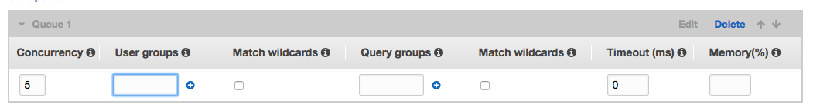
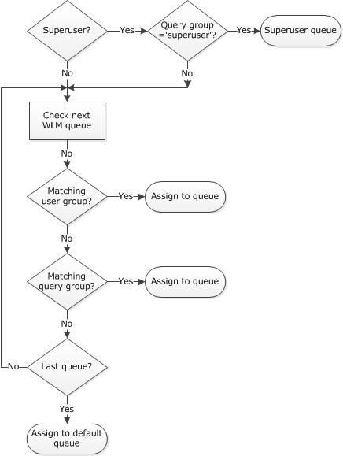

### Redshift Workload Management

* Rules to route queries to queues

    * Manage long / short running queries so short ones don’t have to get stuck waiting for long ones

    * Configure memory allocation to queues

    * Improve performance and experience

#### Limits (not on test?)

<table>
  <tr>
    <td>Concurrent user connections (not queries)</td>
    <td>500</td>
  </tr>
  <tr>
    <td>Total concurrency level for all user-defined queues (concurrent queries)</td>
    <td>50</td>
  </tr>
  <tr>
    <td>Max number of user defined queues</td>
    <td>8</td>
  </tr>
  <tr>
    <td>Superuser queues (if you’re logged in a superuser, queries automatically go to this queue, like dedicated sa connection in SQL Server?)</td>
    <td>1</td>
  </tr>
  <tr>
    <td>Default concurrency per queue</td>
    <td>5</td>
  </tr>
</table>

#### Redshift - Parameter Groups

* Default one can’t be edited

* Create new parameter group if you want to change default workload management values

* Can match wildcards on User Groups and Query Groups - When wildcard matching is enabled, you can include the ? and _ wildcard characters in the User groups field. 

    * The ? character matches zero or any number of characters 

    * The _ character matches any single character. 

    * Disable wildcard matching to require an exact match with user group labels that contain the ? and _ characters.

* **Example use** - create a user group called smallqueries, assign 30% of memory to this, create a query group called largequeries, assign 70% of memory to this

* **Concurrency** - The number of queries that can run concurrently in the queue. Each query runs in a separate virtual space, called a slot. Memory allocated to the queue is divided among the queue's slots. Valid values are 1 to 50. The maximum concurrency for all queues is 50.

* **User Groups** - Queries run by members of a user group are routed to the first queue that matches the user group name.

* **Query Groups** - Queries that are run after setting a query group label are routed to the first queue that matches the query group label.

* **Timeout (ms)** - The time in milliseconds a query can run before being cancelled. When a query is cancelled, it is automatically routed to the next matching queue. If no match is found, the query is not routed to the default queue. Specify 0 to disable timeout.

* **Memory (%)** - The percent of available memory to allocate to a queue. The memory allocated to a queue is divided equally among the queue's query slots. If you specify a value for one queue, you must specify a value for all queues. The total for all queues can't exceed 100. If the total for all queues is less than 100, the remaining memory is unallocated and managed by the service. By default, WLM allocates an equal share of memory to each queue.

* After creating Parameter Group, assign it to the Redshift cluster and then reboot it so the updated settings take effect.

    * Parameter Group Apply Status will show pending-reboot if you assign PG to cluster but don’t reboot it

* To get a query to run in the largequeries group we created:

`set query_group to largequeries;`
`--example query only here`
`SELECT * FROM table_name where year = 2016;`

* To get all of a user’s query to run in the smallqueries group we created:

<table>
  <tr>
    <td>create user maashu createuser password 'non-stupid-password';
create group smallqueries;
alter group smallqueries add user maashu;</td>
  </tr>
</table>

Changing any of the following "static Workload Management" properties requires a reboot:

* User groups

* User groups wildcard

* Query groups

* Query groups wildcard

Changing any of the following "dynamic Workload Management" properties does NOT require a reboot:

* Concurrency

* Percentage of memory to use per queue

* Timeout

* Priority is more queue based, rather than job or query based... can’t assign, say, priorities of 1-10 to 10 queries

* WLM Queue Assignment Rules

* Any queries that come through that don’t fall into one of these categories go into default queue

* WLM timeout to limit long-running queries

* WLM query queue hopping - If a read-only query, such as a SELECT statement, is canceled due to a WLM timeout, WLM attempts to route the query to the next matching queue based on the WLM Queue Assignment Rules. If the query doesn't match any other queue definition, the query is canceled; it is not assigned to the default queue. A user-defined function (UDF) or any query that writes to the database cannot be rerouted and is simply canceled. Such queries include data manipulation language (DML) statements, data definition language (DDL) statements, and commands that change the database, such as VACUUM.

For Exam:

* Know benefits of workload management

* Scenarios where it would be used

* How WLM configuration works

* See this page and diagram on next page for more info: 

* [http://docs.aws.amazon.com/redshift/latest/dg/cm-c-wlm-queue-assignment-rules.html](http://docs.aws.amazon.com/redshift/latest/dg/cm-c-wlm-queue-assignment-rules.html)

