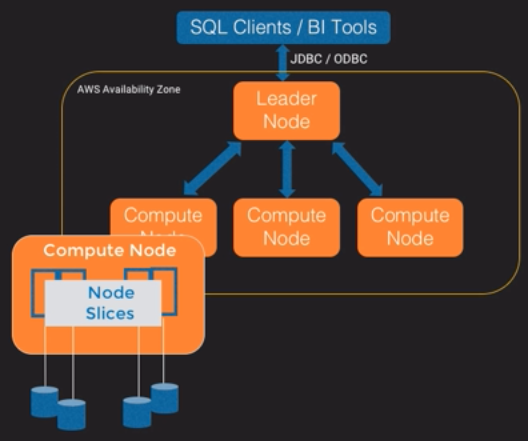
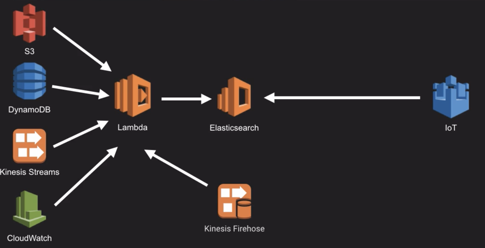

## AWS Certification - Big Data - Domain 4 - Analysis

### Intro to Redshift

* Petabyte-scale data warehouse

* One of AWS’s fastest-growing services

* OLAP

* ANSI-SQL compatible

* Columnar Database

### Redshift Architecture

* Redshift cluster is a cluster of tightly-coupled EC2 instances in a single AZ

    * Because leader node & compute nodes need to be in close proximity network-wise for performance reasons (run on 10GB ethernet mesh network)

* Leader Node

    * Has a SQL endpoint, looks like this: redshift.<unique_id>.<region>.redshift.amazonaws.com:5439

    * Coordinates parallel query execution

    * Stores metadata (think system tables)

* Compute nodes

    * Execute queries in parallel

    * Has dedicated CPU, memory & local storage

    * Scale out/in, up/down

    * Backups done in parallel

    * Consist of slices

**Node Slices** 

* Consist of a portion of memory & disk, data loaded in parallel

* Number of slices depend on type of node

* Come into the picture during table design

**Types of nodes:**

**Dense Compute** - density - high performacne databases - great if you need lots of CPU, RAM and solid state drives

**Dense Storage** - Large data warehouses, less expensive, very large hard drives

Can have Reserved Instance Pricing for Redshift as well

[https://aws.amazon.com/redshift/pricing/](https://aws.amazon.com/redshift/pricing/)

Massively Parallel Processing Database, Shared-Nothing Architecture

* Data stored on multiple nodes

* Nodes have dedicated CPU, memory & local storage

* Nodes are independent, self-sufficient, no disk sharing, no contention b/t nodes

* All communication happens on a high-speed network

### Redshift in the AWS Ecosystem

* S3 will probably be the main source for loading and unloading data, all done in parallel

* Can use **copy** command to load data into Redshift tables from S3 and DynamoDB

copy thermostat_logs from ‘s3://mybucket/my_key/blah/myfile.csv’ credentials ‘aws_iam_role=arn:aws:iam::account_id:role/’

Read: 

copy table_name from s3_location credentials role_name

NOTE - using an IAM role here instead of a username/password or secret keys

* Can use SSH to copy data into Redshift from EMR or EC2 instance

* Can use AWS **Data Pipeline** to schedule & execute data flows to Redshift, or just use it to copy data in without scheduling.  Can also load to RDS or unload from Redhsift.

* **Lambda** - drop files in S3 and automatically have them pulled into Redshift, or manage snapshots via Lambda

* **QuickSight** - BI tool for Redshift

* **AWS Database Migration Service** - migrate data from on-prem or AWS databases to Redshift

* **Kinesis Streams, Firehose & Analytics**

    * **Streams** - streaming data to Redshift

    * **Firehose** - if you don’t need a custom application

    * **Analytics** - use SQL to analyze data from Firehose → Redhsift

* **Amazon Machine Learning** - Can dump data from Redshift into S3 and use Amazon ML to do predictive analytics on it

### Columnar Databases

* DBMS that stores tables as columns rather than rows

* Efficiently write + read data to/from disk in order to speed up the time it takes to return query results

    * Reduces amount of data that needs to be written to / read from disk

    * When we need to read the data, the I/O needed is much less

    * Avoid scanning and discarding unwanted rows

    * More precise = increased query performance 

**Benefits**

* Queries on few columns

* Data aggregation

* Compression

* Lower total cost of ownership

**Do Not Use for**

* Needle in a haystack

* < 100 GB

* Large binary objects

* OLTP

* Avoid single line inserts

* Each column maps to a file in the backend

* Always use COPY command over inserting data row-by-row - much faster

* [https://www.aginity.com/redshift/](https://www.aginity.com/redshift/)

### Table Design - Introduction

* Redshift architecture & its relationship to table design

* How to think about designing tables for Redshift

* Know your data - what are your relationships?

* Instead of indexes - sort keys

* Don’t lift and shift from existing DW solution to Redshift

* Star schema

* Test data set available [here](http://www.tpc.org/tpch/default.asp) - TPC-H

### Table Design - Distribution Styles

#### One of three distribution styles

* **Even** (default distribution style)

    * rows distributed across slices in round-robin fashion regardless of values in column

    * Good for no joins, ok w/ reduced parallelism, where KEY and ALL are not a clear choice

    * Distribution style defined at end of DDL statement

* **Key** - Particularly used when joining tables

    * distribute data evenly among slices

    * Colocate data w/ same key on same slice

    * When distribution keys on large tables haven’t been defined, it can lead to significantly poor performance

    * **Good for** tables used in joins, large fact tables in star schema

    * Distribution style defined **inline** with table creation

* **All** - Copy of entire tables on all nodes of cluster

    * Good for data that does not change, e.g., not more than a few million rows

    * Reasonably sized tables (a few million rows),

    * ...and no common distribution key

    * Distribution style defined at end of DDL statement

* Extra Tips

    * Use guidelines, but also experiment and test

    * Five-part (extra) Resource - [AWS Big Data Blog - Redshift Engineering’s Advanced Table Design Playbook](https://aws.amazon.com/blogs/big-data/amazon-redshift-engineerings-advanced-table-design-playbook-preamble-prerequisites-and-prioritization/)

* Exam Tips

    * Know all three distribution styles

    * Know when you would use each

    * Know their benefits and drawbacks

### Table Design - Sort Keys

* Data stored on disk according to sort key - query optimizer uses sort key to do query plans

* Closest thing to index (not a direct replacement)

* Not all tables need a sort key

* Block size is 1MB default - you don’t need to do anything

* Because block size is larger, I/O is reduced - this helps with performance

* **Zone Maps** - track min and max values for each block

* Load data in sort order - if not, sort key doesn’t really perform the way you thought it would - will read all blocks loaded before where your data is

    * have to run VACUUM command

* **Compound Sort Key** - contains all columns in sort key

    * Default sort type - beneficial when used with:

        * Joins

        * Order by, group by

        * Partition by and order by window functions

    * When you add large amounts of data to a table w/ a compound sort key, over time you have an unsorted region - large parts of table unsorted 

        * have to run a VACUUM operation

        * Then an ANALYZE operation

    * Table sorted by columns listed in sort key order

    * Poor performance if query does not include the primary sort column (first column in sortkey definition)

* **Interleaved Sort Key** - give equal weight to all columns in sort key

    * Useful when you’ve got multiple queries w/ different filters

    * Great when you need to have queries filtering on one or more sort key columns in the WHERE clause

    * Data loading and VACUUM will be slower

    * Most useful on very large tables only - 100 M + rows

    * NOT good for loading data in sort order

* Can have tables w/ single sort key

Guidance on choosing sort keys

* TIMESTAMP column for recent data

* Columns used in BETWEEN conditions or equality operators

* Columns used in a join

* Same column can be used as SORT key and DISTRIBUTION key - can work very well

* Remember to use sort keys and distribution styles! - Very common cause of performance problems

* Tools - AWS scripts on GitHub

* Read this - [Amazon Redshift Engineering’s Advanced Table Design Playbook: Preamble, Prerequisites, and Prioritization](https://aws.amazon.com/blogs/big-data/amazon-redshift-engineerings-advanced-table-design-playbook-preamble-prerequisites-and-prioritization/)

* Read this: [Optimizing for Star Schemas and Interleaved Sorting on Amazon Redshift](https://aws.amazon.com/blogs/big-data/optimizing-for-star-schemas-and-interleaved-sorting-on-amazon-redshift/) 

For Exam:

* Know different sort key types and when to use them

* Know different sort key benefits and drawbacks

### Table Design - Data Types

* 12 data types (see table next page)

* VARCHAR and CHAR stored in BYTES, not length of characters

* [http://docs.aws.amazon.com/redshift/latest/dg/c_Supported_data_types.html](http://docs.aws.amazon.com/redshift/latest/dg/c_Supported_data_types.html)

* Use data types carefully - duh - dates for dates, etc.

* When designing tables - if columns are wider than necessary, there can be a performance impact

    * Redshift data written to temporary table and are not compressed

For the exam

* Very important to know range / width for VARCHAR and CHAR columns - see this link: [http://docs.aws.amazon.com/redshift/latest/dg/r_Character_types.html](http://docs.aws.amazon.com/redshift/latest/dg/r_Character_types.html)

*  Wide columns have a performance impact

The following table lists the data types that you can use in Amazon Redshift tables. 

<table>
  <tr>
    <td>Data Type </td>
    <td>Aliases </td>
    <td>Description </td>
  </tr>
  <tr>
    <td>SMALLINT </td>
    <td>INT2 </td>
    <td>Signed two-byte integer </td>
  </tr>
  <tr>
    <td>INTEGER </td>
    <td>INT, INT4 </td>
    <td>Signed four-byte integer </td>
  </tr>
  <tr>
    <td>BIGINT </td>
    <td>INT8 </td>
    <td>Signed eight-byte integer </td>
  </tr>
  <tr>
    <td>DECIMAL </td>
    <td>NUMERIC </td>
    <td>Exact numeric of selectable precision </td>
  </tr>
  <tr>
    <td>REAL </td>
    <td>FLOAT4 </td>
    <td>Single precision floating-point number </td>
  </tr>
  <tr>
    <td>DOUBLE PRECISION </td>
    <td>FLOAT8, FLOAT</td>
    <td>Double precision floating-point number </td>
  </tr>
  <tr>
    <td>BOOLEAN </td>
    <td>BOOL </td>
    <td>Logical Boolean (true/false) </td>
  </tr>
  <tr>
    <td>CHAR </td>
    <td>CHARACTER, NCHAR, BPCHAR</td>
    <td>Fixed-length character string </td>
  </tr>
  <tr>
    <td>VARCHAR </td>
    <td>CHARACTER VARYING, NVARCHAR, TEXT </td>
    <td>Variable-length character string with a user-defined limit </td>
  </tr>
  <tr>
    <td>DATE </td>
    <td></td>
    <td>Calendar date (year, month, day) </td>
  </tr>
  <tr>
    <td>TIMESTAMP </td>
    <td>TIMESTAMP WITHOUT TIME ZONE</td>
    <td>Date and time (without time zone) </td>
  </tr>
  <tr>
    <td>TIMESTAMPTZ</td>
    <td>TIMESTAMP WITH TIME ZONE</td>
    <td>Date and time (with time zone) </td>
  </tr>
</table>

### Table Design - Compression

#### What is Compression

* Reduces amount of data stored

* Therefore lowers cost

* 3x-10x compression possible

* Queries need to pull less data from disk, leads to performance gains

* Each column can be compressed

* Used like this in column DDL: 

* <COLUMN_NAME> <DATATYPE> [NOT NULL] ENCODE <ENCODING_TYPE>

* From [http://docs.aws.amazon.com/redshift/latest/dg/c_Compression_encodings.html](http://docs.aws.amazon.com/redshift/latest/dg/c_Compression_encodings.html)

<table>
  <tr>
    <td>Encoding type</td>
    <td>Keyword in CREATE TABLE and ALTER TABLE</td>
    <td>Data types</td>
  </tr>
  <tr>
    <td>Raw (no compression)</td>
    <td>RAW</td>
    <td>All</td>
  </tr>
  <tr>
    <td>Byte dictionary</td>
    <td>BYTEDICT</td>
    <td>All except BOOLEAN</td>
  </tr>
  <tr>
    <td>Delta</td>
    <td>DELTA
DELTA32K</td>
    <td>SMALLINT, INT, BIGINT, DATE, TIMESTAMP, DECIMAL
INT, BIGINT, DATE, TIMESTAMP, DECIMAL</td>
  </tr>
  <tr>
    <td>LZO</td>
    <td>LZO</td>
    <td>All except BOOLEAN, REAL, and DOUBLE PRECISION</td>
  </tr>
  <tr>
    <td>Mostlyn</td>
    <td>MOSTLY8
MOSTLY16
MOSTLY32</td>
    <td>SMALLINT, INT, BIGINT, DECIMAL
INT, BIGINT, DECIMAL
BIGINT, DECIMAL</td>
  </tr>
  <tr>
    <td>Run-length</td>
    <td>RUNLENGTH</td>
    <td>All</td>
  </tr>
  <tr>
    <td>Text</td>
    <td>TEXT255
TEXT32K</td>
    <td>VARCHAR only
VARCHAR only</td>
  </tr>
  <tr>
    <td>Zstandard</td>
    <td>ZSTD</td>
    <td>All</td>
  </tr>
</table>

* If you copy data into a table w/ compression setup, data will be compressed

* DEMO - why compression helps - run same queries on two sets of two tables, one compressed, one not. Big difference, 25% in this example

#### How does it work?  One of two ways:

* **Automatically** (AWS recommended) - When data is loaded into brand new table, COPY command 

    * loads 100k rows, 

    * runs behind the scenes ANALYZE COMPRESSION command, 

    * determines types of encodings needed, 

    * drops table, 

    * recreates table with compression encodings, 

    * and then all the data is loaded

* **Manually** (run ANALYZE COMPRESSION command, modify DDL manually)

    * Add this to end of COPY command:

<table>
  <tr>
    <td>compupdate off</td>
  </tr>
</table>

    * Then can run:

<table>
  <tr>
    <td>analyze compression table_name;</td>
  </tr>
</table>

* The above will give you compression recommendations based on the data you’ve loaded into the table with the "compupdate off" statement added to the end of the COPY command.  You’d then need to drop and recreate your table, recreate the DDL based on the recommendations, and reload the data into the new table

For the exam, know:

* Benefits of compression

* How compression works in Redshift

### Table Design - Constraints

* BIG TAKEAWAY - Really, only the NOT NULL is respected in Redshift

#### Column-level constraints - only NOT NULL is enforced

* PRIMARY KEY

* UNIQUE

* NOT NULL / NULL

* REFERENCES

#### Table constraints - NONE are enforced

* PRIMARY KEY

* FOREIGN KEY

* UNIQUE

* REFERENCES

* **Only** use constraints if your application uses them

* Query planner uses some constraints when building queries (e.g., PKs, FKs), in subqueries it helps order large joins, helps eliminate redundant joins

**For the Exam:**

* PKs and FKs can be defined but are NOT enforced

* They’re there to drive performance only or for information purposes

### Table Design - Review Design - NOTHING in this lab is on exam

* [https://github.com/awslabs/amazon-redshift-utils](https://github.com/awslabs/amazon-redshift-utils)

* Folders currently include:

    * AdminScripts

    * AdminViews

    * AnalyzeVacuumUtility

    * ColumnEncodingUtility

    * Investigations

    * LambdaRunner

    * SnapshotManager

    * UnloadCopyUtility

* Check for distribution keys, sort keys, compression, etc.

### Redshift Workload Management

* Rules to route queries to queues

    * Manage long / short running queries so short ones don’t have to get stuck waiting for long ones

    * Configure memory allocation to queues

    * Improve performance and experience

#### Limits (not on test?)

<table>
  <tr>
    <td>Concurrent user connections (not queries)</td>
    <td>500</td>
  </tr>
  <tr>
    <td>Total concurrency level for all user-defined queues (concurrent queries)</td>
    <td>50</td>
  </tr>
  <tr>
    <td>Max number of user defined queues</td>
    <td>8</td>
  </tr>
  <tr>
    <td>Superuser queues (if you’re logged in a superuser, queries automatically go to this queue, like dedicated sa connection in SQL Server?)</td>
    <td>1</td>
  </tr>
  <tr>
    <td>Default concurrency per queue</td>
    <td>5</td>
  </tr>
</table>

#### Redshift - Parameter Groups

* Default one can’t be edited

* Create new parameter group if you want to change default workload management values

* Can match wildcards on User Groups and Query Groups - When wildcard matching is enabled, you can include the ? and _ wildcard characters in the User groups field. 

    * The ? character matches zero or any number of characters 

    * The _ character matches any single character. 

    * Disable wildcard matching to require an exact match with user group labels that contain the ? and _ characters.

* **Example use** - create a user group called smallqueries, assign 30% of memory to this, create a query group called largequeries, assign 70% of memory to this

* **Concurrency** - The number of queries that can run concurrently in the queue. Each query runs in a separate virtual space, called a slot. Memory allocated to the queue is divided among the queue's slots. Valid values are 1 to 50. The maximum concurrency for all queues is 50.

* **User Groups** - Queries run by members of a user group are routed to the first queue that matches the user group name.

* **Query Groups** - Queries that are run after setting a query group label are routed to the first queue that matches the query group label.

* **Timeout (ms)** - The time in milliseconds a query can run before being cancelled. When a query is cancelled, it is automatically routed to the next matching queue. If no match is found, the query is not routed to the default queue. Specify 0 to disable timeout.

* **Memory (%)** - The percent of available memory to allocate to a queue. The memory allocated to a queue is divided equally among the queue's query slots. If you specify a value for one queue, you must specify a value for all queues. The total for all queues can't exceed 100. If the total for all queues is less than 100, the remaining memory is unallocated and managed by the service. By default, WLM allocates an equal share of memory to each queue.

* After creating Parameter Group, assign it to the Redshift cluster and then reboot it so the updated settings take effect.

    * Parameter Group Apply Status will show pending-reboot if you assign PG to cluster but don’t reboot it

* To get a query to run in the largequeries group we created:

<table>
  <tr>
    <td>set query_group to largequeries;
--example query only here
SELECT * FROM table_name where year = 2016;</td>
  </tr>
</table>

* To get all of a user’s query to run in the smallqueries group we created:

<table>
  <tr>
    <td>create user maashu createuser password 'non-stupid-password';
create group smallqueries;
alter group smallqueries add user maashu;</td>
  </tr>
</table>

Changing any of the following "static Workload Management" properties requires a reboot:

* User groups

* User groups wildcard

* Query groups

* Query groups wildcard

Changing any of the following "dynamic Workload Management" properties does NOT require a reboot:

* Concurrency

* Percentage of memory to use per queue

* Timeout

* Priority is more queue based, can’t assign, say, priorities of 1-10 to 10 queries

* WLM Queue Assignment 

* Any queries that come through that don’t fall into one of these categories go into default queue

* WLM timeout to limit long-running queries

* WLM query queue hopping - If a read-only query, such as a SELECT statement, is canceled due to a WLM timeout, WLM attempts to route the query to the next matching queue based on the WLM Queue Assignment Rules. If the query doesn't match any other queue definition, the query is canceled; it is not assigned to the default queue. A user-defined function (UDF) or any query that writes to the database cannot be rerouted and is simply canceled. Such queries include data manipulation language (DML) statements, data definition language (DDL) statements, and commands that change the database, such as VACUUM.

For Exam:

* Know benefits of workload management

* Scenarios where it would be used

* How WLM configuration works

* See this page and diagram on next page for more info: 

* [http://docs.aws.amazon.com/redshift/latest/dg/cm-c-wlm-queue-assignment-rules.html](http://docs.aws.amazon.com/redshift/latest/dg/cm-c-wlm-queue-assignment-rules.html)

### Redshift Data Loading Part 1

#### Source Services for copying data into Redshift 

##### Direct Integration

* S3 - one of the most common ways (fastest way) to move data into Redshift

* EC2 instance

* EMR / HDFS

* DynamoDB - can copy straight from table

##### Indirect (Must stage to S3 first)

* Kinesis-enabled app

* Kinesis Firehose

* DMS (Database Migration Service)

* Can also do files land in S3, which triggers a Lambda function (COPY command)

* See this blog post on [Using AWS Lambda with Amazon Redshift](https://aws.amazon.com/blogs/big-data/a-zero-administration-amazon-redshift-database-loader/), see also [this Github repo](http://github.com/awslabs/aws-lambda-redshift-loader)

#### Moving Data to AWS

* CLI + multipart upload option

* Direct Connect 

* AWS Import / Export

* AWS Import / Export Snowball

* Loading data from S3 is most common and fastest method

* Efficient in loading data in parallel from S3

copy tablename from 's3://mybucket/myfile.whatever' credentials 'aws_iam_role=arn:aws:iam::accountnumber:role/redshift'

* Much more secure to use roles than to use access keys and secret keys

* Access keys and secret keys **are** needed when copying encrypted data into Redshift

* Slices can be used for parallelism in loading data to speed up load times

* Compare loading TPC-H dataset in one chunk vs. splitting it into 8 chunks (50 GB) - much faster with the 8 chunks (~9 minutes vs. ~4.5 minutes)

    * You can use the same script from before if you just append .nnn (where nnn is number of the chunk) to the end of the split files) if you remove the original file from the directory

Remember this slide from Architecture?

* Each compute node has node slices

* Each node slice allocated a portion of node’s memory and disk space

* [See Node Type Details on this page](http://docs.aws.amazon.com/redshift/latest/mgmt/working-with-clusters.html) to get info on slices, memory, node range and total capacity for Dense Storage Node Types and Dense Compute Node Types

* Slices are generally either 2, 16, or 32

* Also can query the stv_slices system table to get this information

* Compress large files can help load times - gzip, lzip or bzip

* Try to keep file sizes even as possible so nothing’s skewed like in Spark / Hadoop

* After compression, try to keep file sizes from 1 MB - 1 GB each

* **DynamoDB** - when ingesting production and you think you’re going to go over your reads, best practices is to have a copy of the table and ingest from that

* **EC2** - can use an "SSH manifest" file - contains endpoint IPs of Redshift cluster nodes

**For the exam**

* Know number of slices and data files for each node type

* Know loading - best to have number of files equal to number of slices or multiples of the number of slices, e.g., 4 slices = 4 or 8 files

### Redshift Data Loading Part 2

* Manifest - JSON file

    * Load required files only

    * Load files from different buckets

    * Load files with different prefixes

    * Can set mandatory = true if you want the job to fail if the file is not there

    * Put manifest file in FROM part of COPY command, use "manifest" as last word in the copy command

    * This helps if you’ve got a bunch of files in a bucket and you only want to load a few

**For the exam:**

* Know 3 scenarios where manifest may be used:

    * Load required files only

    * Load files from different buckets

    * Load files with different prefixes

### Redshift Data Loading Part 3

#### Data Formats

* CSV

* Delimited (e.g., pipe)

* Fixed width

* JSON

* Avro

#### Error Checking - System Tables	

* STL_LOAD_ERRORS

* STL_LOADERROR_DETAIL

* ^ can join these two as well to get even more information when COPY command fails

* SELECT * = BAD (duh)

* Upsert statements not supported - use staging table if:

1. you need to replace existing rows

    * Want to replace all data in target table

    * Use all rows in staging table to merge into target table

    * Target and staging columns match

* **Example**: Run delete and insert in single transaction

* Here’s a link: [http://docs.aws.amazon.com/redshift/latest/dg/t_updating-inserting-using-staging-tables-.html](http://docs.aws.amazon.com/redshift/latest/dg/t_updating-inserting-using-staging-tables-.html)

2.    Specify a column list (mimic UPSERT) - us this if:

* Update specific columns in target table

* Most rows in staging table will not be used to update target table

**For the exam, know:**

* UPSERT not supported

* Understand when staging tables re used

* Know the two methods to merge data (illustrated above)

### Redshift Data Loading Data Part 4

* [http://docs.aws.amazon.com/redshift/latest/dg/c_loading-encrypted-files.html](http://docs.aws.amazon.com/redshift/latest/dg/c_loading-encrypted-files.html)

* [http://docs.aws.amazon.com/redshift/latest/dg/t_unloading_encrypted_files.html](http://docs.aws.amazon.com/redshift/latest/dg/t_unloading_encrypted_files.html)

#### Loading encrypted data

* Using the **COPY** command you can load encrypted files from S3 where the following encryption was applied:

    * SSE with S3-managed keys (SSE-S3)

    * SSE with KMS-Managed keys (SSE-KMS)

        * COPY command automatically recognizes and loads files encrypted using SSE-S3 and SS3-KMS

    * Client-side encryption using client-side symmetric master key

        * Use **master_symmetric_key** parameter in COPY command (also use **encrypted** option)

* The following are NOT supported

    * SSE w/ customer-provided keys (SSE-C)

    * Client-side encryption using KMS-managed **customer** master key

    * Client-side encryption using a customer-provided **asymmetric** master key

* **UNLOAD** command - unloads query results into one or more files from Redshift into S3

    * Automatically creates files using SSE-S3 (AES-256)

    * Can specify SSE-KMS - use **KMS_KEY_ID** parameter in UNLOAD command (also use **encrypted** option) 

    * Can also unload using client-side encryption with customer-managed key (CSE-CMK)

* **UNLOAD** command does NOT support:

    * SSE w/ customer-provided keys (SSE-C)

### Redshift Maintenance and Operations Part 1

#### Launching Clusters

* Cluster identifier, database name, database port, master username, master password, confirm password

* Select node types

    * DC1, DS1, DS2

    * DC1.large, DC1.8xlarge

    * DS2.xlarge, DS2.8xlarge

    * DS1.xlarge, DS1.8xlarge

    * DS1 vs. DS2 - DS2 are newer, give better performance at no extra cost

* If you have very large amounts of data - use DS2

* If you need very high I/O - use DC1 - DC1 uses SSD storage

* Node selection

    * Cluster should have free space worth 2 - 2.5x times the size of your largest table

    * Know for exam - specs (e.g., node range, slices per node, storage per node) for various node sizes - study Dense Storage Node Types and Dense Compute Node Types tables on this page: [http://docs.aws.amazon.com/redshift/latest/mgmt/working-with-clusters.html](http://docs.aws.amazon.com/redshift/latest/mgmt/working-with-clusters.html)

* Select parameter group or create new one - can set timeouts, configure cluster to require SSL connection (REQUIRE_SSL param to true)

* Encrypt database - none, KMS, HSM

* Choose VPC, subnet group, publicly accessible, public IP address, enhanced VPC routing, AZ, security groups

* Can select role so you don’t have to have keys on nodes

#### Resizing Clusters

* THINK - how much data do you have, how much is coming in, how much going out, in what timeframe?

* Resize process

    * Notification kicks off creation of target cluster

    * Source cluster is restarted and goes into read-only mode, all running queries and connections are terminated

    * Reconnect to source cluster to run queries in read-only mode

    * Redshift starts to copy data from source cluster to target cluster

    * Once data copying has completed, Redshift updates the DNS endpoint of the target cluster with the DNS endpoint of the source cluster

    * Source cluster is decommissioned

#### For the Exam

* Study Node Type details table - you may be asked about resizing a cluster from a few large nodes to a cluster w/ many small nodes

* What types of workloads DC1 nodes are good for vs DS2

    * DC1 - high I/O (SSD) but less storage

    * DS2 - very large amounts of data, HDD storage

### Redshift Maintenance and Operations Part 2

#### Vacuum

* Redshift blocs are immutable

* Updates result in a new block

* Deleted rows are not removed from disk

* Old rows consume disk space and get scanned when a query is executed

* Wasted storage space and performance degradation

* VACUUM helps recover space and sorts the table

* VACUUM FULL - applies to every table in database - sorts & reclaims space

* VACUUM FULL <TABLENAME> -  sorts & reclaims space on specific table

* VACUUM SORT ONLY - applies to every table in database - sorts only (no reclaiming disk space)

* VACUUM DELETE ONLY - applies to every table in database - reclaims disk space only from rows marked for delete by previous update and delete operations (no sorting)

* VACUUM REINDEX <TABLENAME> - analyzes distribution of index in interleaved sort key columns, then performs full VACUUM operation

    * use for tables with interleaved sort keys

* Use VACUUM after bulk deletes, data loading, or after updates 

* VACUUM is I/O intensive - so only use this during lower periods of activity or during maintenance windows

* Don’t put off using VACUUM!

* **Analyze & Vacuum Schema Utility** - Redshift utilities on Github - can tell us when tables need to be vacuumed - two scripts:

1. Queries Redshift log tables to get list of tables that need to be vacuumed based on alerts raised by optimizer

    * Vacuum command then run on those tables

    * Recommended to use this to update statistics metadata so RS query optimizer can generate more accurate query plans

1. Runs analyze command on tables based on alerts raised in RS log tables

* Ideally, avoid VACUUM operation by	

    * Loading data in sort key order, and

    * Using time series tables

* With very large tables - recommendation is to perform a **deep copy**

    * Recreates and repopulates the table with a bulk insert

    * Bulk insert automatically sorts the table

    * Deep copy much faster than running vacuum

    * VACUUM utiling not recommended for tables > 700 GB

#### Deep Copy - Three Ways

1. Create new table using original DDL, do INSERT INTO new table

2. CREATE TABLE <TABLENAME> (LIKE <OLDTABLENAME>);

3. Create temp table as SELECT * FROM from <OLDTABLENAME>, then truncate old table and insert from temp table

* For 1 & 2, drop old table, rename new table.  For 3, just drop temp table

* For exam - method #1 is preferred for deep copy (fastest)

#### Backup and Restore

* Snapshots can be automatic or manual

##### Automated snapshots

* Automated and continuous

* 8-hour intervals or every 5 GB of data changes

* Default retention period = 1 day, can go up to 35 days for retention

    * If you need more frequent snapshots, check Redshift Snapshot Manager on GitHub

##### Manual Snapshots

* Can be taken anytime, just click Backup >> Take Snapshot, give it an "identifier"

* Can copy automated snapshot, keep as manual snapshot

* In CREATE TABLE DDL, can specify **BACKUP NO**

#### Cross-Region Snapshots

* Select Configure Cross-Region Snapshots - automatically copies automated and manual snapshots to specific region

* Any new snapshots get copied to new region

* If you’re using cross-region KMS-Encrypted Snapshots for KMS Encrypted clusters - snapshots are encrypted

    * KMS keys are region-specific!

* FOR EXAM - know how x-region snapshots are handled when they’re encrypted

* Configure Snapshot Copy Grant - select KMS Key

#### Restore from Snapshot

* New cluster Redshift creates from snapshot will have same configuration, including number and type of nodes from cluster snapshot was taken

* Can restore a single table from snapshot - specify source snapshot, database, schema, table, and target database, schema and table name

#### Monitoring

* Can use CloudWatch metrics - use Performance tab in RS console gives access to same metrics, just a different view

* Also have Queries tab where you can monitor query performance

* Loads tab - monitor data loading performance

* AWS Labs has Redshift monitoring utility - based on Lambda and CloudWatch

    * Gives insight into some of the top performance tuning techniques for RS

    * When implemented, you see custom graphs in CloudWatch

#### For the exam 

* Understand VACUUM and why it helps to run it

* Deep copy - what is it?

* Deep copy - know best method is to create new table from existing DDL

* Cross-Region KMS-Encrypted Snapshots

    * Create a snapshot copy grant in the destination region

### Redshift Lab

#### What we’ll cover

1. Create and connect to a cluster

2. Create sets of tables

    1. With with compression encodings

    2. Without compression encodings

    3. With distribution keys, sort keys, and compression encodings

3. Load data into tables

4. Run queries against tables

[Factors Affecting Query Performance](http://docs.aws.amazon.com/redshift/latest/dg/c-query-performance.html)

* Create a new security group 

    * Create an inbound rule for Redshift, using either your IP or IP of an EC2 instance running Aginity Workbench

* Create a new role to read data from S3

    * IAM >> Roles >> Create New >> Redshift >> AmazonS3FullAccess

* Create a cluster subnet group - allows you to specify a set of subnets in your VPC where you can deploy your cluster

    * Redshift >> Security >> Subnet Groups >> Create	Subnet Group

    * Can add multiple AZs if you want

* Clusters >> Launch Cluster (use dc1.large node type, only one node)

    * No encryption

    * Select cluster subnet group

    * Publicly available, No "choose public IP address" (will use Elastic IP), No enhanced VPC routing, no CloudWatch alarm, use Role we created

* Wait (and wait) for cluster to be created

* Once you get an endpoint, if you can’t connect, check your inbound rule, make sure you can get in from wherever you’re trying to connect from

* SQL Workbench/J needs JDK 8, 

* [http://www.oracle.com/technetwork/java/javase/downloads/jdk8-downloads-2133151.html](http://www.oracle.com/technetwork/java/javase/downloads/jdk8-downloads-2133151.html)

* Make sure you’ve got the Autocommit checkbox checked in SQL Workbench/J

* Also, make sure you’ve got the URL right, it should look like this (note the "/database" after the endpoint:port bit):

jdbc:redshift://*endpoint*:*port*/*database*

* My account number: 358695872585

* [https://github.com/sko71/aws-bigdata-specialty/blob/master/Domain%204/redshiftlab.txt](https://github.com/sko71/aws-bigdata-specialty/blob/master/Domain%204/redshiftlab.txt)

* NOTE:  Be sure that manifest files are copied up to S3 per the video for this to work

* The first time you run a query, Redshift compiles the code and sends the compiled code to the compute nodes - here we’ll compare the query times based on the second run of the query

* Redshift creates snapshots by default, you can’t delete them, only Redshift can.  Default retention period is 1 day

* [Working With Snapshots](http://docs.aws.amazon.com/redshift/latest/mgmt/working-with-snapshots.html): Only Amazon Redshift can delete an automated snapshot; you cannot delete them manually. Amazon Redshift deletes automated snapshots at the end of a snapshot’s retention period, when you disable automated snapshots, or when you delete the cluster. If you want to keep an automated snapshot for a longer period, you can create a copy of it as a manual snapshot. The automated snapshot is retained until the end of retention period, but the corresponding manual snapshot is retained until you manually delete it.

### Machine Learning Part 1

* Gives computers the ability to learn without being explicitly programmed

* Amazon Machine Learning only does supervised learning

* If you need to do unsupervised learning, you can do EMR Spark/MLib

* [Amazon Machine Learning Process](http://docs.aws.amazon.com/machine-learning/latest/dg/the-machine-learning-process.html)

**Three model types supported:**

* Binary classification model

* Multiclass classification model

* Regression model

**The process:**

* Need a datasource (S3 CSV, RDS, Redshift)

* Split data (training set/ "evaluation” set) - default 70/30

* Shuffle data - Amazon ML creates better models when data is in random order

* Data transformations / optimizations

* Train model

* Select model parameters / customize

* Evaluate model (see [this link](http://docs.aws.amazon.com/machine-learning/latest/dg/evaluating_models.html))

* Feature selection / adjust learning / model size

* Set score - Score for prediction accuracy

* Use model - real time / batch

###  Machine Learning Multiclass Classification Model

* Create datasource - data can be CSV in S3 or can extract data from Redshift

* Data types automatically inferred, can change if you need to

* Select whether first line has column names

* Pick "Target" column

* Optionally pick "Row Identifier" - this will get added to output if you choose it

* AWS ML will automatically pick model best suited for dataset based on the data (e.g., Multiclass Classification model)

* Create data source.  This can take a while

* Next, select "Create (Train) ML Model"

* Can select various training and evaluation settings ("Custom" vs. “Default”)

    * Transform data using "recipes" - JSON-like syntax - instructions for transforming data as part of ML process

    * ML service will then perform data transformations for you

    * Can change training parameters

    * Can choose sequential or random splitting

    * ML uses 70/30 split by default

#### Results

* F1 score - 0-1 range, higher = better, compare to baseline F1 score

* Performance - Confusion matrix

**For the Exam**

* Remember - use **Multiclass Classification Model** to generate predictions for multiple classes

* **F1 score** - measures quality of model, ranges from 0-1 - higher = better

* Know how to interpret confusion matrix

* Read this: [Building a Multi-Class ML Model with Amazon Machine Learning](https://aws.amazon.com/blogs/big-data/building-a-multi-class-ml-model-with-amazon-machine-learning/)

* Also know about [Building a Numeric Regression Model with Amazon Machine Learning](https://aws.amazon.com/blogs/big-data/building-a-numeric-regression-model-with-amazon-machine-learning/) and [Building a Binary Classification Model with Amazon Machine Learning and Amazon Redshift](https://aws.amazon.com/blogs/big-data/building-a-binary-classification-model-with-amazon-machine-learning-and-amazon-redshift/)

### Amazon Machine Learning Binary Classification Model

* NOTE:  This is mostly a demo that I’ve done before.  See these links:

* [http://docs.aws.amazon.com/machine-learning/latest/dg/tutorial.html](http://docs.aws.amazon.com/machine-learning/latest/dg/tutorial.html)

* [https://aws.amazon.com/blogs/big-data/building-a-binary-classification-model-with-amazon-machine-learning-and-amazon-redshift/](https://aws.amazon.com/blogs/big-data/building-a-binary-classification-model-with-amazon-machine-learning-and-amazon-redshift/)

* Create data source pointing to dataset, "y" is target where 1 = yes

* Create model with all default values

* AUC metric - measures ability of model to predict a higher score

    * Independent of the actual score

    * Value ranges from 0-1, with 1 being really good, 0.5 is baseline, meaning not good, and 0 meaning something wrong with data (?)

* Look at sample charts - know that a bad chart would be one histogram overlapping the other, where a good one would have very little overlap, e.g., only in the tails

* Know what true positive, true negative, false positive, false negative mean

* Cutoff score (trade-off based on score threshold) defaults to 0.5, in a box marked "Trade-off based on score threshold"

* Updating this to set the value higher, TP and TN rates both drop

* Can save this updated score so when you rerun the model it will predict positives at a higher value (e.g., .75 instead of .5)

**Steps for Batch Predictions:**

1. Select model

2. Select data source

3. Select destination for batch results

4. Review and submit job

* Can download results and see "bestAnswer" (0 or 1) and score (0-1.00) - those (at or?) above threshold marked as 1 in “bestAnswer” column

* Can also use a model to do realtime predictions by pasting in a record (or probably hooking it to a Lambda?)

For the Exam:

* Know business scenarios for when to use binary classification model

* AUC - measures prediction accuracy of the model, ranges from 0 to 1

* Know how to interpret the histograms

* Know how to set cutoff score threshold, and why you would increase a threshold

* Read this: [https://aws.amazon.com/blogs/big-data/building-a-binary-classification-model-with-amazon-machine-learning-and-amazon-redshift/](https://aws.amazon.com/blogs/big-data/building-a-binary-classification-model-with-amazon-machine-learning-and-amazon-redshift/)

### Amazon Machine Learning Regression Model

* [https://aws.amazon.com/blogs/big-data/building-a-numeric-regression-model-with-amazon-machine-learning/](https://aws.amazon.com/blogs/big-data/building-a-numeric-regression-model-with-amazon-machine-learning/)

Interpreting Results

* RMSE = root mean squared error - shoot for lower than baseline value given (the lower the better the model)

* Look at histogram - left and right side are residuals - 

    * If the line is centered at 0, that tells us any mistakes made are done in a random manner, no over or under prediction 

    * If the line is centered BELOW 0, it means that the actual target is SMALLER than the predicted target

    * If the line is centered ABOVE 0, it means that the actual target is GREATER than the predicted target

* Models that don’t create a residual histogram that’s normal-looking and centered at 0 are prone to prediction errors

**For the Exam, know:**

* How to use the Regression Model to predict a numeric value

* RMSE measures quality of model, lower value = higher quality

* Know how to interpret the regression model histogram

* Read this: [https://aws.amazon.com/blogs/big-data/building-a-numeric-regression-model-with-amazon-machine-learning/](https://aws.amazon.com/blogs/big-data/building-a-numeric-regression-model-with-amazon-machine-learning/)

### Machine Learning Lab

* Data comes from UC Irvine repo [Adult Data Set](https://archive.ics.uci.edu/ml/datasets/adult)

* Dude converted it to CSV, added column headers, and target column (1 = > 50k, 0 = < 50k) - [data is here](https://github.com/sko71/aws-bigdata-specialty/blob/master/Domain%204/adult_census_data.csv)

* Not much new information here that’s not covered in other lectures, but be sure to do it to get the hands-on experience with it

* Also recommended to do the AWS lab on Machine Learning, which uses a marketing offer dataset [http://docs.aws.amazon.com/machine-learning/latest/dg/tutorial.html](http://docs.aws.amazon.com/machine-learning/latest/dg/tutorial.html)

### Elasticsearch

* ES - distributed, multi-tenant-capable full-text search engine

* HTTP web interface

* Schema-free JSON documents

* **Logstash** - data collection & log parsing engine

* **Kibana** - open source data viz and exploration tool

* "ELK stack"

* Use cases:

    * Search

    * Logging analysis (e.g., for near realtime security)

    * Distributed document store

    * Real-time app monitoring (again, using logs)

    * Clickstream weblog ingestion

* AWS ES Service - fully managed

    * Prior, had to install ES on EC2

    * Now, underlying instances provisioned for you, along with patching, failure recovery, backups, monitoring, security (IAM for security, CloudTrail for auditing)

* **Elasticsearch Service Domain** - AWS term - Collection of all the resources you need to run your ES cluster

#### Cluster configuration

* Number and type of instances

* Dedicated master nodes (Yes/No) - 

    * used to increase cluster stability

    * performs cluster management tasks, but doesn’t hold data or respond to data upload requests.

    * Offload cluster management tasks to increase stability of cluster

    * Tracking all nodes in cluster

    * Tracking number of indices in cluster

    * How many shards belong to each index

    * Cluster state changes, etc.

    * AWS recommends 3 dedicated master nodes for each Amazon ES domain in production

    * One active master node that handles all cluster management tasks, rest are passive until master fails

    * See [Managing Amazon Elasticsearch Service Domains](http://docs.aws.amazon.com/elasticsearch-service/latest/developerguide/es-managedomains.html) for guidelines on number of data and master nodes 

* Distribute across AZs, setup replica of cluster for HA

* Storage and snapshot settings - instance store or EBS volumes

* Index settings

* IAM policies to allow / block access to a domain

#### ES and Other Services

* Elasticsearch + IoT

    * Can write rule action to write data from MQTT messages to ES service domain

    * Data in ES can then be visualized w/ something like Kibana

* ES + S3, DynamoDB, Kinesis Streams, Kinesis Firehose, Cloudwatch all integrate through Lambda

    * Lambda function reacts to new data by processing it, and streaming it to the ES Service Domain

#### Indices and Shards

* Data nodes handle all data upload requests

* Index ~= table - logical namespace, maps to 1+ primary shards and 0+ replica shards

* (schema-free) JSON docs ~= rows, stored in a shard

* When you add a document to an index, it’s first stored on primary shard, then on replica shard if required

* Replica shards:

    * Help with performance

    * Help if there’s an issue with the primary shard

* Search requests can be handled by either primary or replica shard

* A replica shard is on a separate node from its primary counterpart

* AWS - can setup zone awareness - allocate nodes across two AZs in the same region

    * E.g., primary shards in us-east-1a and replicas in us-east-1b

    * HA, but slight uptick in network latency

* DEMO - follows [How to Visualize and Refine Your Network’s Security by Adding Security Group IDs to Your VPC Flow Logs](https://aws.amazon.com/blogs/security/how-to-visualize-and-refine-your-networks-security-by-adding-security-group-ids-to-your-vpc-flow-logs/#more-3559)

#### Logstash

* Data collection & log parsing engine

* AWS ES Service integrates with the Logstash output plugin - AWS - can download from Github

    * Can install this on app instance, which then pushes data to AWS ES Service domain

* Can use this without having to write code, however, you do have to install it on your application server

* Lambda, of course, is serverless, but you do have to write code

**For the exam:**

* Know the basics of AWS ES service

* Have a high-level understanding of how Kibana and Logstash are used with AWS ES Service

